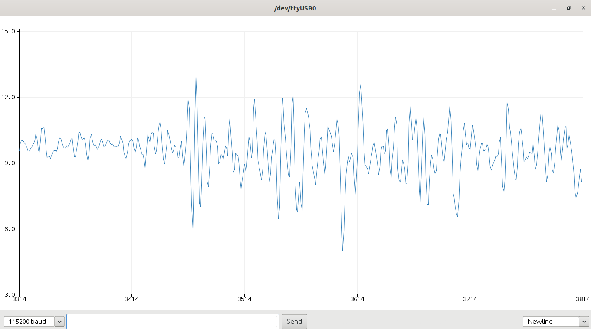
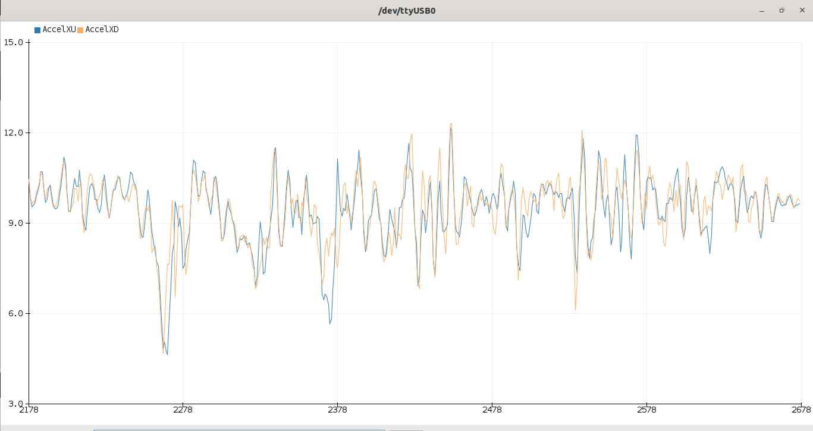
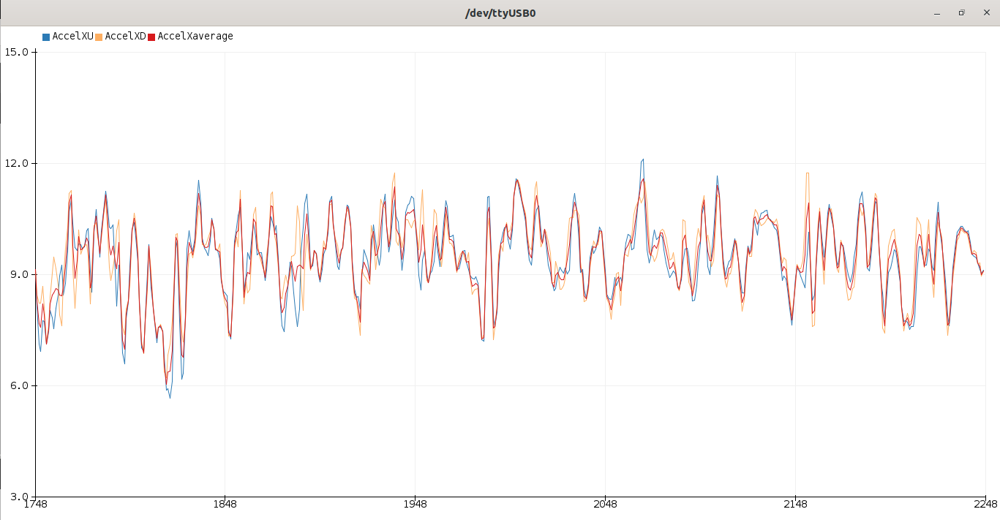
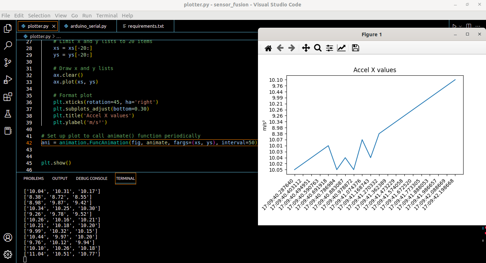

# python-arduino-serial-plotter
Before writing a guidence or detection algorithm be sure your data are accurate and reliable. This makes other algorithms more efficent. This example helps to reduce the noise of the data with two imus. Noise on a data is not correlated with each other so if we take average of two imus, the data will be denoised.

#### Acceleration data on X axis on first imu


#### Acceleration data on X axises of two imus


#### Acceleration data on X axises of two imus and average


##### to run the code you need to download [AdafruitMPU6050](https://github.com/adafruit/Adafruit_MPU6050) library and install python libraries
```
pip3 install -r requirements.txt
python3 plotter.py
```
#### The python code shows realtime serial data with matplotlib. 

